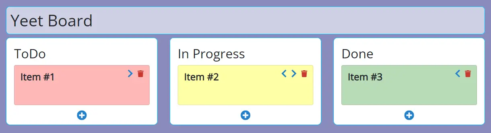

[](https://www.codefactor.io/repository/github/schufeli/yeet-board)
[](https://github.com/Schufeli/yeet-board/actions/workflows/deno_unit_test.yml)

# Yeet Board



A simple Kanban board web application written in JavaScript and Deno was made as a school project for the Module M133.

## :package: Deployment

For easier deployment the source code supports docker so you can just run the following command

```docker compose up --build```

## :hammer_and_wrench: Development

### Dependencies
1. [Deno](https://deno.land/)

### Starting the environment

To start the development environment you can run the following command inside of the `api` folder

``` deno run --allow-net --allow-read mod.ts ```

## :label: Contributors

- [schufeli](https://github.com/schufeli)
- [ThankorRS](https://github.com/ThankorRS)
